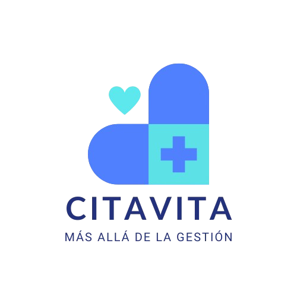

  

# Proyecto Citavita
Sistema de administración hospitalaria intuitivo y robusto que centralice la información de citas, expedientes médicos, y datos de los pacientes, con el fin de optimizar los procesos internos del hospital, asegurar una atención puntual y personalizada, y brindar a los pacientes acceso seguro a su información de salud.

# Software empleado.
- [Git](https://git-scm.com) 
- [VSCode](https://code.visualstudio.com/)
- [Docker Compose](https://docs.docker.com/desktop/setup/install/windows-install/)

# Archivos compilados del proyecto Citavita
- [Citavita](https://drive.google.com/drive/folders/1jh0xl558JbcO1WEpzjOk5haZ-h8ImWvq?usp=sharing)

# Link de los repositorios del proyecto 
- [Citavita Frontend](https://github.com/JulioJohan/Citas-Frontend.git)
- [Citavita Backend](https://github.com/Karla038/ApHospital.git)
